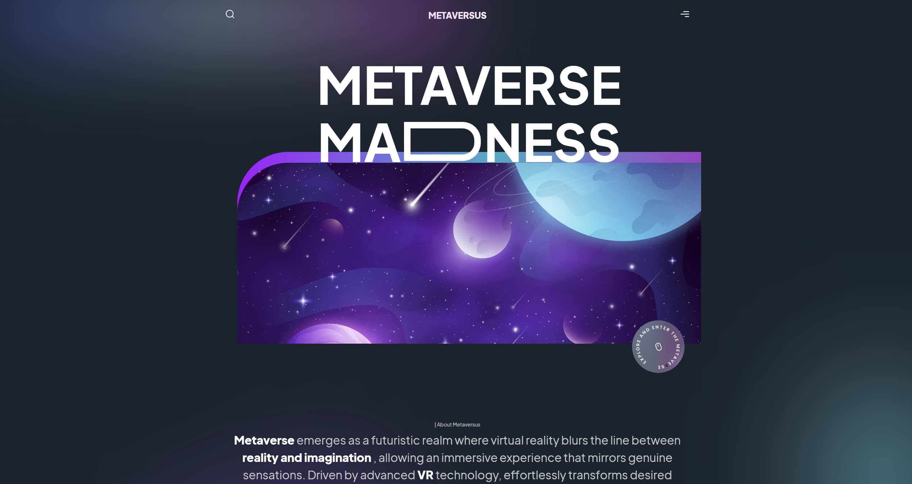
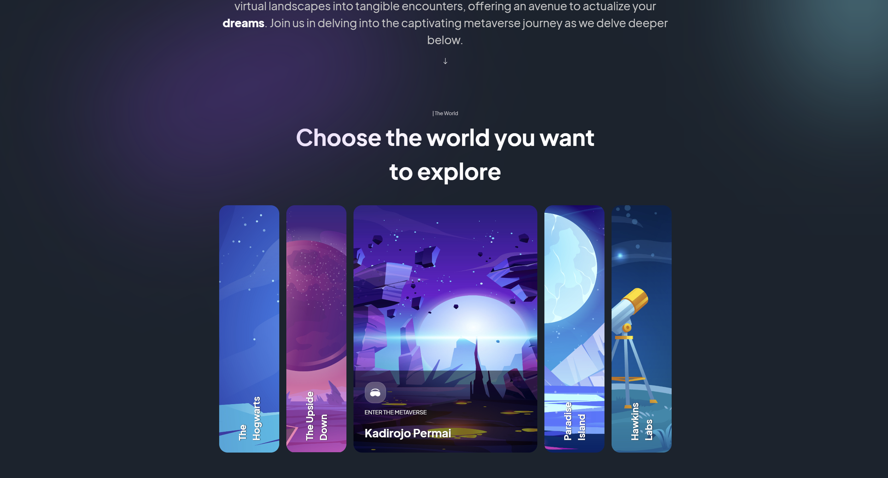
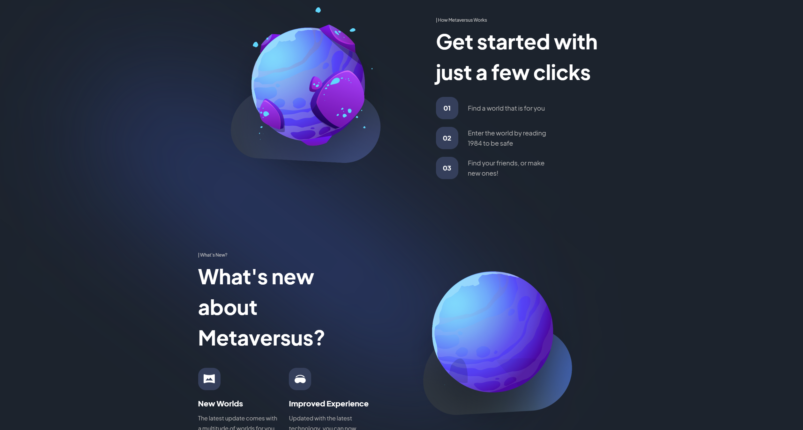
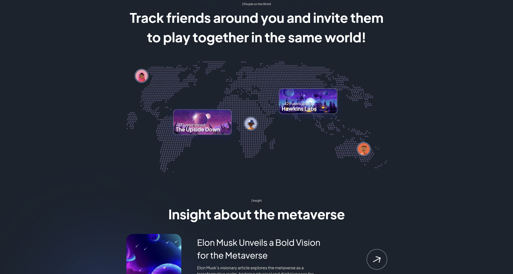
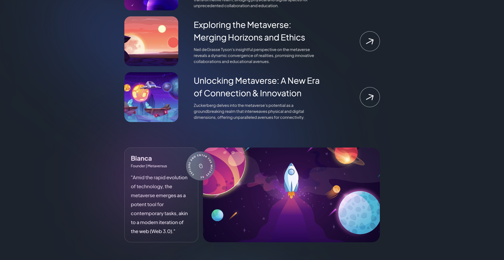

# NextJS Metaverse Website

    
    
    
    
    
    

This program is to test the Next framework and JavaScript language, building a basic metaverse website.

This has been built into a website accessible here: https://sommos.github.io/nextjs_metaverse_website/

# Contribution

If you'd like to contribute to `nextjs_metaverse_website` please submit a pull-request on a feature branch.

# Installing

Clone the repo:

    git clone https://github.com/Sommos/nextjs_metaverse_website
    cd nextjs_metaverse_website
